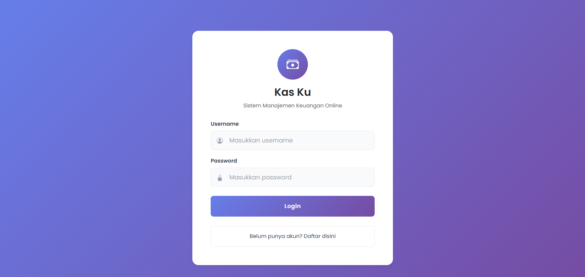
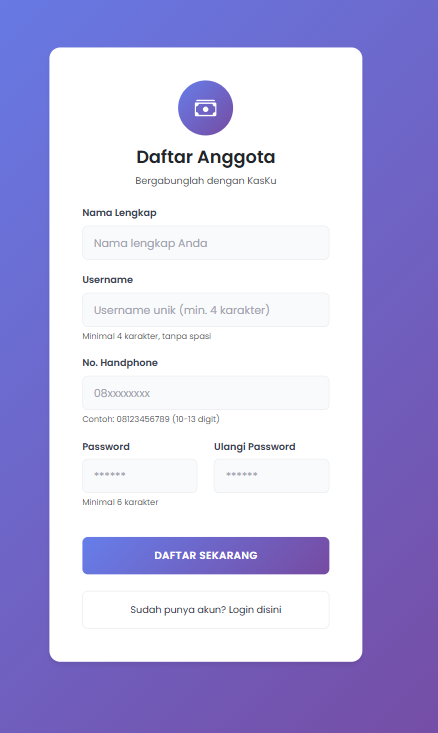
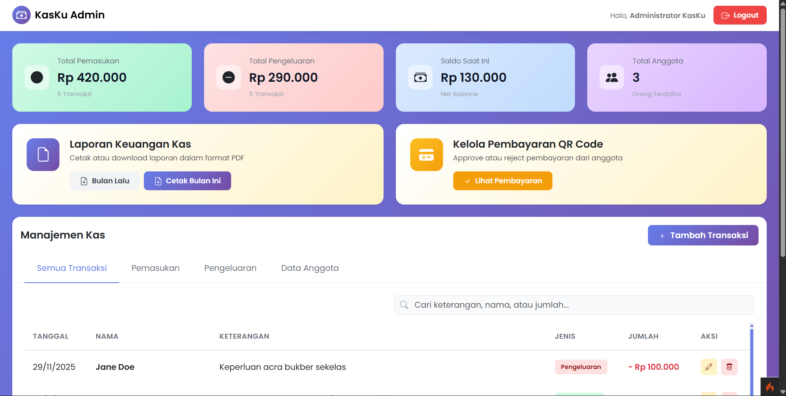
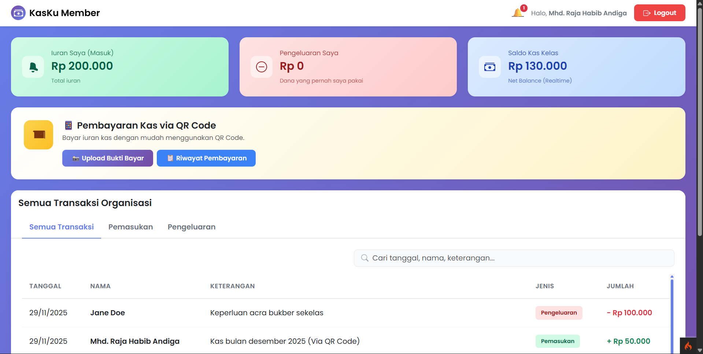
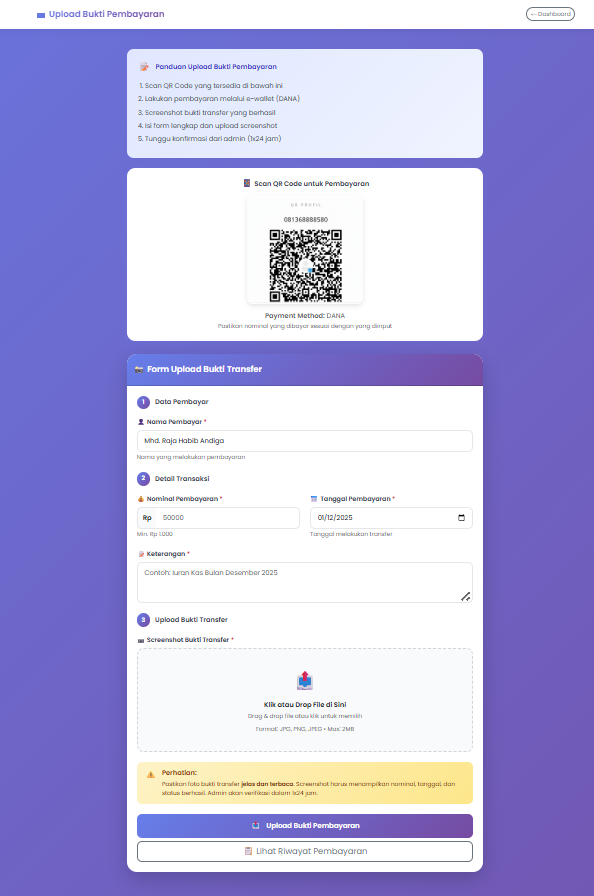
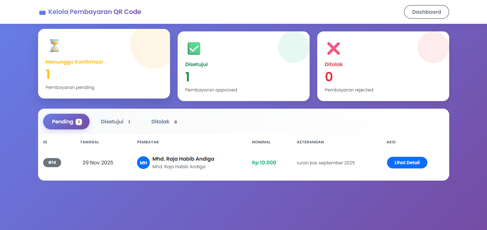
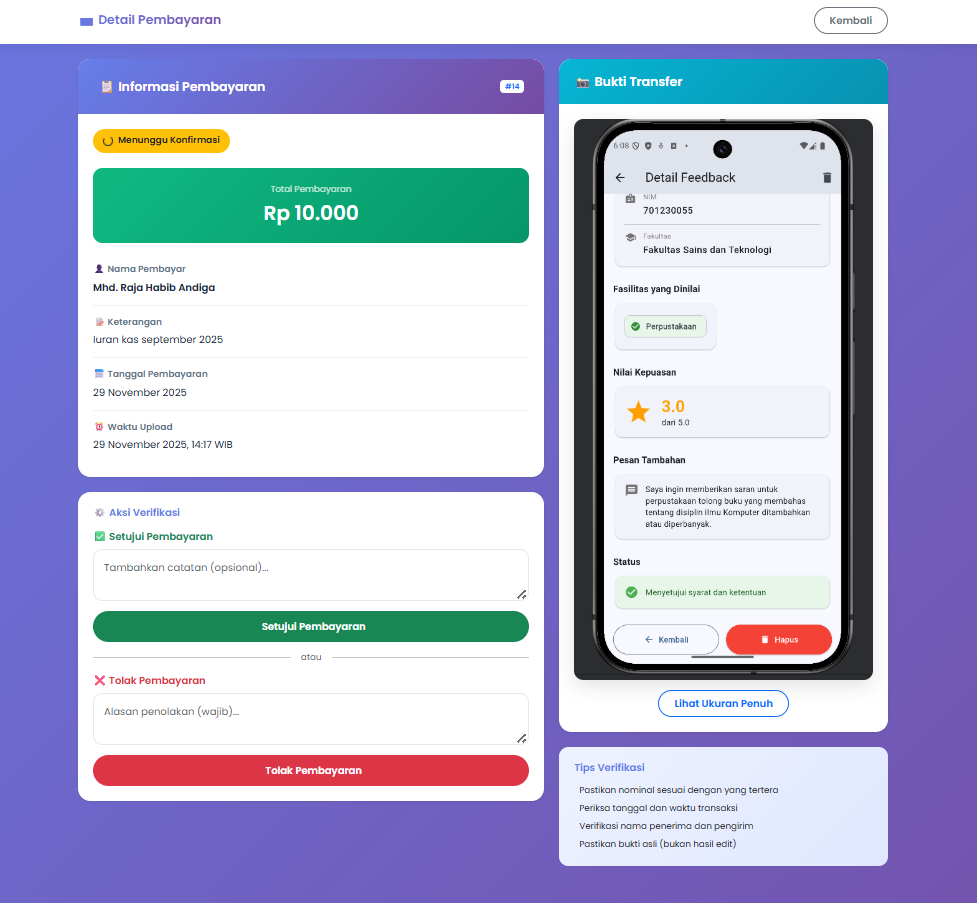

# 💰 KasKu - Aplikasi Manajemen Uang Kas

<div align="center">


[](https://codeigniter.com/)
[](https://getbootstrap.com/)
[](https://www.mysql.com/)
[](LICENSE)

**KasKu** adalah aplikasi manajemen uang kas berbasis web yang dirancang untuk membantu organisasi, kelompok, atau individu dalam mencatat, mengelola, dan memantau pemasukan serta pengeluaran secara digital, transparan, dan efisien.

[Fitur](#-fitur-utama) • [Instalasi](#-instalasi) • [Penggunaan](#-cara-penggunaan) • [Screenshot](#-screenshot) • [Tim](#-tim-pengembang)

</div>

---

## 📋 Daftar Isi

- [Tentang Project](#-tentang-project)
- [Fitur Utama](#-fitur-utama)
- [Teknologi yang Digunakan](#-teknologi-yang-digunakan)
- [Instalasi](#-instalasi)
- [Cara Penggunaan](#-cara-penggunaan)
- [Screenshot](#-screenshot)
- [Struktur Database](#-struktur-database)
- [Tim Pengembang](#-tim-pengembang)
- [Lisensi](#-lisensi)

---

## 🎯 Tentang Project

**KasKu** dikembangkan untuk mengatasi permasalahan pengelolaan kas yang masih manual dan rentan terhadap kesalahan pencatatan. Aplikasi ini menyediakan solusi digital yang memudahkan:

- 📊 Pencatatan transaksi pemasukan dan pengeluaran secara real-time
- 💳 Pembayaran iuran kas melalui QR Code
- 📈 Laporan keuangan otomatis dalam format PDF
- 🔔 Sistem notifikasi pembayaran untuk anggota
- 👥 Manajemen data anggota
- 🔐 Keamanan data dengan autentikasi dan enkripsi password

Project ini dikembangkan sebagai bagian dari tugas akhir mata **kuliah Rekayasa Perangkat Lunak**, dengan dosen pengampu Ibu Dila Nurlaila, M.Kom, pada Program Studi Sistem Informasi, Fakultas Sains dan Teknologi, Universitas Islam Negeri Sultan Thaha Saifuddin Jambi.

---

## ✨ Fitur Utama

### 🔑 Untuk Admin/Bendahara
- ✅ Login & Autentikasi
- ✅ Dashboard dengan statistik keuangan (Total Pemasukan, Pengeluaran, Saldo, Jumlah Anggota)
- ✅ Pencatatan Transaksi (Pemasukan & Pengeluaran)
- ✅ Manajemen Data Anggota (Tambah, Edit, Hapus)
- ✅ Riwayat Transaksi dengan Filter & Pencarian
- ✅ Laporan Keuangan (Export PDF)
- ✅ Kelola Pembayaran QR Code (Approve/Reject)
- ✅ Kirim Notifikasi ke Anggota

### 👤 Untuk User/Anggota
- ✅ Login & Autentikasi
- ✅ Dashboard Personal (Iuran Masuk, Pengeluaran, Saldo Kas)
- ✅ Pembayaran Iuran via QR Code
- ✅ Upload Bukti Transfer
- ✅ Riwayat Pembayaran
- ✅ Notifikasi Status Pembayaran (Pending, Disetujui, Ditolak)
- ✅ Lihat Semua Transaksi Organisasi

---

## 🛠 Teknologi yang Digunakan

### Backend
- **Framework:** CodeIgniter 4 (MVC Architecture)
- **Language:** PHP 8.x
- **Database:** MySQL 8.0

### Frontend
- **CSS Framework:** Bootstrap 5.x
- **JavaScript:** Vanilla JavaScript (ES6+)
- **Icons:** Bootstrap Icons, SVG

### Tools & Libraries
- **Server:** Apache (XAMPP/Laragon)
- **Version Control:** Git & GitHub
- **PDF Export:** TCPDF/Dompdf (via CodeIgniter)

---

## 📥 Instalasi

### Prasyarat
Pastikan sistem Anda sudah terinstall:
- PHP >= 8.0
- MySQL >= 8.0
- Apache Server (XAMPP/Laragon/WAMP)
- Composer (opsional)
- Git

### Langkah Instalasi

1. **Clone Repository**
   ```bash
   git clone https://github.com/Afrizal74/KasKu.git
   cd KasKu
   ```

2. **Konfigurasi Database**
   - Buka **phpMyAdmin** (http://localhost/phpmyadmin)
   - Buat database baru dengan nama `kasku_db`
   - Import file SQL yang ada di folder `database/` (jika tersedia)
   - Atau buat tabel secara manual sesuai struktur berikut:

   **Tabel yang diperlukan:**
   - `users` - Data pengguna (admin & anggota)
   - `transaksi` - Riwayat transaksi kas
   - `pembayaran_qris` - Data pembayaran via QR Code
   - `notifikasi` - Notifikasi untuk user
   - `migrations` - Tracking migrasi database

3. **Konfigurasi Environment**
   - Rename file `.env.example` menjadi `.env` (jika ada)
   - Atau edit langsung file `.env` dengan konfigurasi berikut:

   ```env
   CI_ENVIRONMENT = development
   app.baseURL = 'http://localhost:8080/'
   
   database.default.hostname = localhost
   database.default.database = kasku_db
   database.default.username = root
   database.default.password = 
   database.default.DBDriver = MySQLi
   database.default.port = 3306
   ```

4. **Jalankan Aplikasi**
   
   **Menggunakan PHP Built-in Server:**
   ```bash
   php spark serve
   ```
   Akses: http://localhost:8080

   **Menggunakan Apache (XAMPP/Laragon):**
   - Pindahkan folder project ke `htdocs/` atau `www/`
   - Akses: http://localhost/KasKu/public
  

5. **Cek Link yang Sudah Kami Hosting untuk Mencoba Aplikasi dengan Lebih Mudah**
  - Link Deployment: https://kasku.xo.je
---

## 🚀 Cara Penggunaan

### Login Akun Demo

#### Admin/Bendahara
```
Username: admin
Password: admin123
```

#### User/Anggota
```
Username: user
Password: user123
```

### Alur Penggunaan

#### 👨‍💼 Sebagai Admin:
1. Login dengan akun admin
2. Lihat dashboard untuk melihat statistik keuangan
3. Kelola transaksi melalui menu **Manajemen Kas**
4. Tambah/Edit/Hapus anggota di tab **Data Anggota**
5. Approve/Reject pembayaran QR Code di menu **Kelola Pembayaran**
6. Export laporan keuangan dalam format PDF
7. Kirim notifikasi ke anggota

#### 👤 Sebagai User:
1. Login dengan akun user
2. Lihat dashboard personal
3. Klik **Upload Bukti Bayar** untuk membayar iuran
4. Scan QR Code yang ditampilkan
5. Upload bukti transfer
6. Tunggu approval dari admin
7. Cek status pembayaran di **Riwayat Pembayaran**
8. Terima notifikasi jika pembayaran disetujui/ditolak

---

## 📸 Screenshot

<details>
<summary>Klik untuk melihat screenshot</summary>

### 🔐 Halaman Login

*Halaman login yang simple dan modern dengan validasi form*

### 📝 Halaman Registrasi

*Form pendaftaran anggota baru dengan validasi lengkap*

### 📊 Dashboard Admin

*Dashboard admin dengan statistik lengkap dan quick actions*

### 👥 Dashboard User

*Dashboard user dengan informasi iuran dan saldo kas*

### 💳 Pembayaran QR Code

*Halaman upload bukti pembayaran dengan QR Code DANA*

### 📋 Kelola Pembayaran (Admin)

*Halaman approve/reject pembayaran dari anggota*

### 📜 Riwayat Pembayaran (User)

*Riwayat pembayaran dengan status yang jelas*

</details>

> **Note:** Screenshot disimpan di folder `docs/screenshots/`. Silakan tambahkan screenshot sesuai kebutuhan.

---

## 🗄 Struktur Database

### Tabel Utama

#### 1. `users`
Menyimpan data pengguna (admin & anggota)
```sql
- id (PK, Auto Increment)
- nama (VARCHAR)
- username (VARCHAR, Unique)
- password (VARCHAR, Hashed)
- hp (VARCHAR)
- role (ENUM: 'admin', 'user')
- status (ENUM: 'aktif', 'nonaktif')
- created_at (DATETIME)
- updated_at (DATETIME)
```

#### 2. `transaksi`
Menyimpan riwayat transaksi kas
```sql
- id (PK, Auto Increment)
- user_id (FK to users)
- jenis (ENUM: 'pemasukan', 'pengeluaran')
- jumlah (DECIMAL)
- keterangan (TEXT)
- tanggal (DATE)
- created_at (DATETIME)
- updated_at (DATETIME)
```

#### 3. `pembayaran_qris`
Menyimpan data pembayaran via QR Code
```sql
- id (PK, Auto Increment)
- user_id (FK to users)
- nominal (DECIMAL)
- keterangan (TEXT)
- tanggal_pembayaran (DATE)
- bukti_transfer (VARCHAR)
- status (ENUM: 'pending', 'approved', 'rejected')
- created_at (DATETIME)
- updated_at (DATETIME)
```

#### 4. `notifikasi`
Menyimpan notifikasi untuk user
```sql
- id (PK, Auto Increment)
- user_id (FK to users)
- pesan (TEXT)
- is_read (BOOLEAN)
- created_at (DATETIME)
```

#### 5. `migrations`
Tracking migrasi database CodeIgniter

---

## 👥 Tim Pengembang

<table>
  <tr>
    <td align="center">
      <br />
      <sub><b>Mhd. Raja Habib A</b></sub><br />
      <sub>701230031</sub><br />
      <a href="mailto:mhd.rajahabib@gmail.com">📧 Email</a> •
      <a href="tel:+6281368888580">📱 081368888580</a>
    </td>
    <td align="center">
      <br />
      <sub><b>Afrizaldi</b></sub><br />
      <sub>701230005</sub><br />
      <a href="mailto:afrizal7405@gmail.com">📧 Email</a> •
      <a href="tel:+6208997651926">📱 08997651926</a>
    </td>
    <td align="center">
      <br />
      <sub><b>Adittia Krisna Putra</b></sub><br />
      <sub>701230037</sub><br />
      <a href="mailto:adittiakrisnaputra@gmail.com">📧 Email</a> •
      <a href="tel:+62088747568703">📱 088747568703</a>
    </td>
  </tr>
</table>

**Institusi:**  
Program Studi Sistem Informasi  
Fakultas Sains dan Teknologi  
Universitas Islam Negeri Sultan Thaha Saifuddin Jambi  
**Tahun:** 2025

---

## 🙏 Acknowledgments

- **CodeIgniter Community** - Framework PHP yang powerful dan mudah digunakan
- **Bootstrap Team** - CSS Framework yang memudahkan development UI
- **Dosen Pembimbing** - Bimbingan dan arahan selama pengembangan project
- **Teman-teman Kelas 5A** - Dukungan dan feedback selama development

---

## 📞 Kontak & Support

Jika ada pertanyaan, bug report, atau saran pengembangan, silakan:

- 🐛 [Buat Issue](https://github.com/Afrizal74/KasKu/issues) di GitHub
- 📧 Email ke salah satu developer
- 💬 Hubungi via WhatsApp

---

<div align="center">

**⭐ Jangan lupa berikan star jika project ini bermanfaat! ⭐**

Made with ❤️ by **KasKu Development Team**

</div>